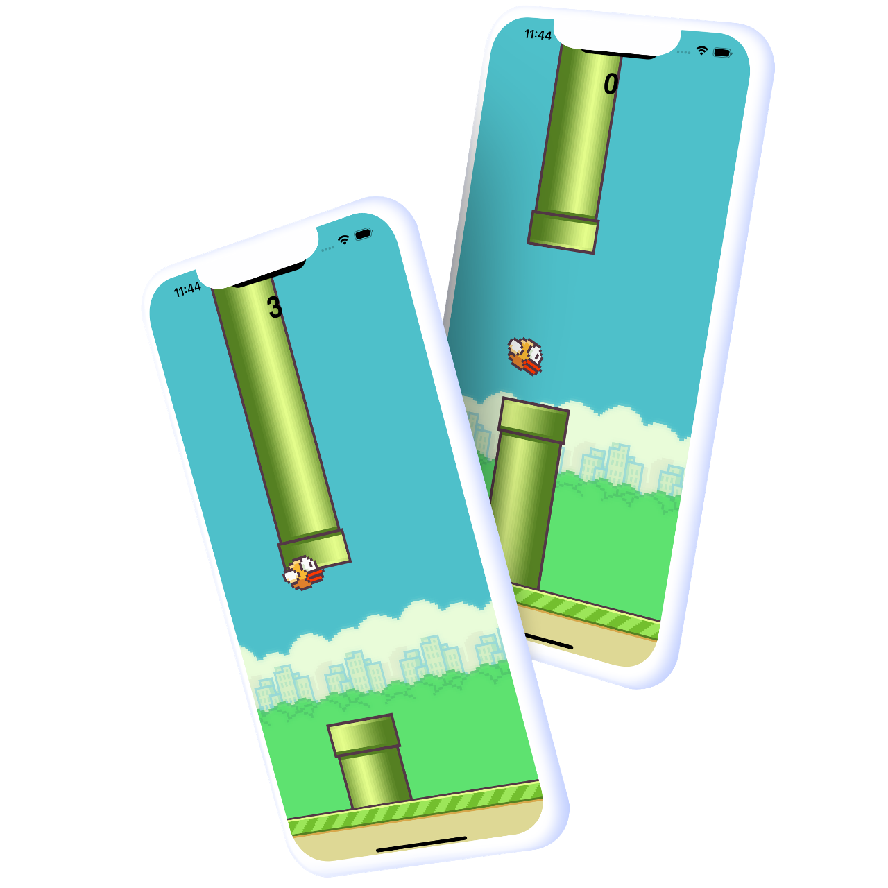

<h4 align="center">
  🚀 Flappy Bird with Skia & Reanimated
</h4>

<p align="center">
  

  

  <a href="https://github.com/WallysonGalvao/flappybird/commits/main">
    
  </a>

  <a href="https://github.com/WallysonGalvao/flappybird/issues">
    
  </a>

  
</p>

<p align="center">
  <a href="#-projeto">Project</a>&nbsp;&nbsp;&nbsp;|&nbsp;&nbsp;&nbsp;
  <a href="#-layout">Layout</a>&nbsp;&nbsp;&nbsp;|&nbsp;&nbsp;&nbsp;
  <a href="#rocket-techs">Techs</a>&nbsp;&nbsp;&nbsp;|&nbsp;&nbsp;&nbsp;
  <a href="#rocket-run">Run</a>
</p>
<br>

## 💻 Project

This project is based on [notJust․dev - Build Flappy Bird with React Native: Skia & Reanimated Tutorial](https://www.youtube.com/watch?v=9F4aICEisVI)

## 🎨 Layout

<h1 align="center">
       
</h1>

## :rocket: Techs

This project was developed with the following technologies:

- [React Native](https://reactnative.dev/) + [Expo](https://docs.expo.dev/) + [Typescript](https://www.typescriptlang.org/)
- [Skia](https://shopify.github.io/react-native-skia/)
- [Reanimated](https://docs.swmansion.com/react-native-reanimated/)

\* For more details, see the **[package.json](./package.json)**

## :notebook: Run

```bash
# Clone this repository
$ git clone https://github.com/WallysonGalvao/flappybird.git

# Access the project folder in your terminal/cmd
$ cd flappybird

# Install project dependencies
$ yarn install

# Run the application
$ yarn android ou yarn ios
```

---

<p align="center">Made with hours in front :computer: by <a href="https://linkedin.com/in/wallyson-galvao" target="blank"> Wallyson Galvão</a></p>
<p align="center">
<a href="https://linkedin.com/in/wallyson-galvao" target="blank"></a>
<a href="https://medium.com/@wallyson.galvao" target="blank"></a>
</p>
